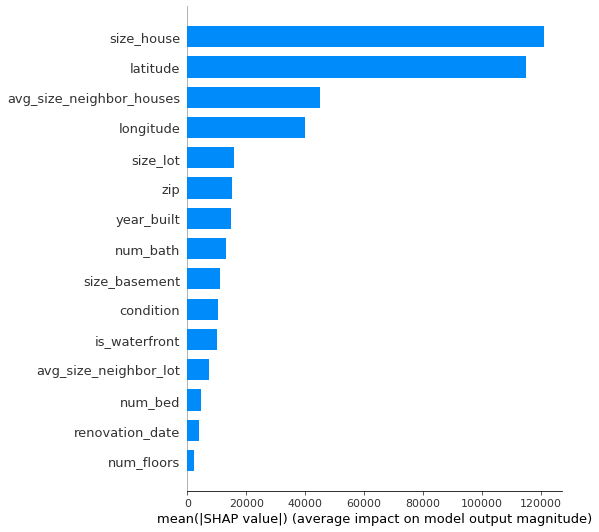
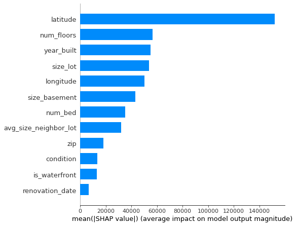

# test-rappi-DS
This repository has the purpose to store the code for the Rappi selection process for Sergio Ehijo. In particular, for the Data Scientist role.

# Process of reading and getting the model
Hi, so if you are reading this, welcome. The order which i would love for the project to be used goes as follows: 
1. Use and run all cells of the *variable_analysis.ipynb* notebook. 
    - In that notebook we see a first approach of how the different features are correlated between each other and with the target (housing prices). 
    - There is a little text whether to delete them or use them.
2. Use the *model_updated_version.ipynb* notebook.
    - In this model we create a xgboost Regression model, which help us make the linear regression that we want to do in order to predict housing prices in that region. 
3. By the end of 2.), you will have a trained model. In order to predict housing prices (as was said in the inputReadme, there is another dataset for that), you can use model.predict, of course taking into notice that the data could be worked a little bit (i am using **could** here because im not entirely sure a normal dataframe would work here given that it was trained with Dmatrices). This means that you should use the library of xgboost and the DMatrix method. 

On the other hand, if you are short on time, you can just load the model (available in assets as a pickle file) and use it with the hold out data to predict and test.

# Which variables affect more the prices
As we can see at the end of the notebook "model_updated_version.ipynb", we have a graph which represents the feature importance of our model. Given that we are creating a linear regression model to infer pricing houses in a certain region, and we have this graph, we can conclude at the same time that those variables affect the pricing houses of that region, per the model. 

The top 5 variables which affect pricing houses the most are: 
- Size_house
- Latitude
- avg_size_neighbor_houses
- Longitude
- size_lot

.

As we can see from the first notebook, we thought the variables that maybe affect our model, given a high correlation with the target variable (housing prices), could be taken out. The model created in this notebook uses all variables, and actually, highly correlated variables which we though to take out was size_house and avg_size_neighbor_houses. Really interesting. 

So, to make things clear as of RMSE and see how much it affects the predictions, we created another notebook which is called "model_less_variables.ipynb". In this notebook we create a model without the three variables that we thought it could be a nice idea to delete in the "variable_analysis.ipynb". 

The difference of RMSE is close to 45 !! (RMSE original_model is: 132396.11 and RMSE of less_variables_model is : 177008.11).  So it's clear that although correlated variables between each other could be deleted, if they are as well correlated with the target, maybe it is not such a good idea to delete them. Of course, this analysis is done with the time and resources(variables, csv and data) that was given for this challenge.  And other point worth considerating, is that is not recommended to compare two differents RMSE values because they might come from different data; here as we are using the same inputs, we can actually compare the RMSE values. And of course, a lower RMSE is better than a higher RMSE, just thought it was worth being mentioned. 

.

Other analysis here can be made. It is not asked but it is interesting as far as ex post analysis. What we can see in the second image is that Latitude is still one of the most important features, but another feature that wasn't really important in the first model (with all the features) does make a difference in the second model (with less features). That variable is num_floors. 
This means that maybe a more exhaustive analysis can be made for the pre processing part, or just that num_floors shares information with the deleted variables. This can be seen with the graph in *variable_analysis.ipynb*, which is also available in the assets folder by the way. 

# Next steps

Of course, what here is being delivered are a few notebooks that run a code and get a model as output. Cool. But is not scalable, i am not proud of that. 
What i think is worth mentioning is of course that a few more analysis of data cleaning could be made, as well as taking all the code and encapsulating it in a few classes. This isn't only cleaner, but enables for pipeline creation (if it were necessary).

This here is an MVP, that i was able to do after my actual job. Of course it has flaws, but is what i could do with the time i put into it. 

Thank you for reading if you got this far ! 

# My internal process and why there is one more notebook

So, we know that the first notebook i wrote was "variable_analysis.ipynb". That is not into discussion. The thing is, Wednesday night, i wanted to get a first model as fast as i could, so i just decided to go ahead coding without any Markdowns. We can see that disaster into the notebook "model_creation_and_testing.ipynb". 

In that notebook, what we can see, in a not orderly fashion, is that i am doing basically the same steps as into the final notebook ("model_updated_version.ipynb").
The steps are:
- Load the data
- Get a first model with xgboost with basic values of parameters. 
- Start doing the hyperparameter tuning separately (taking tuples and then doing a gridsearch for them.)
- After doing a few of these, train the final model with the selected parameters.
- Then, use Shap to see a little bit of explanation as of which variables are the ones that matter the most into getting a prediction. 

